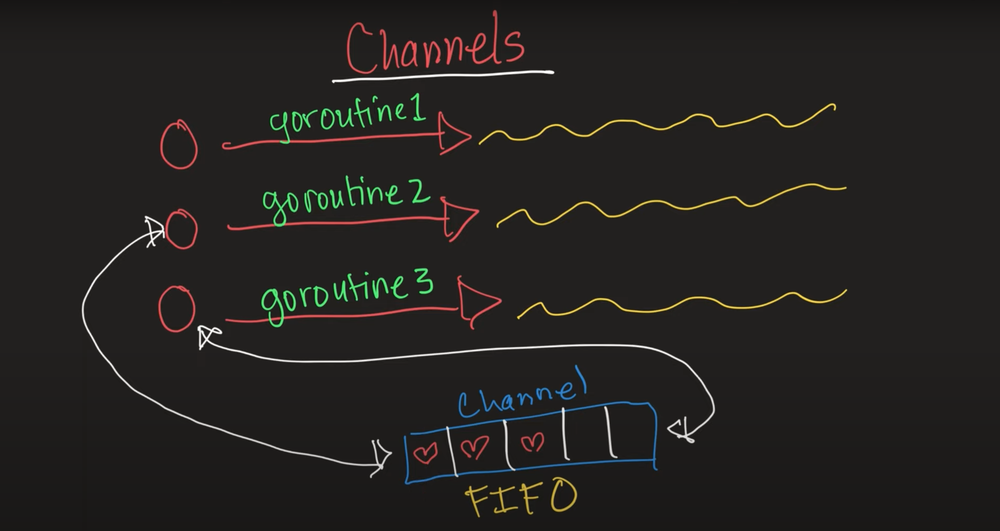
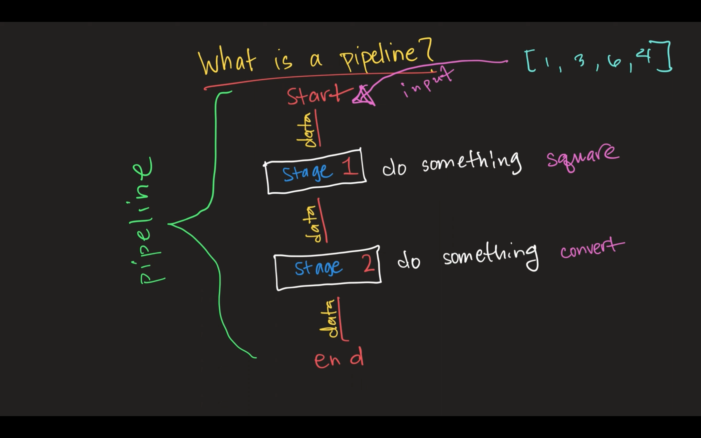
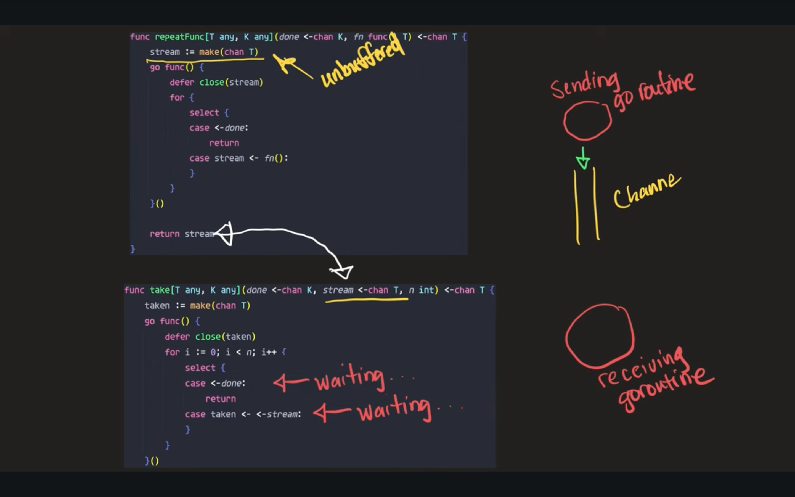
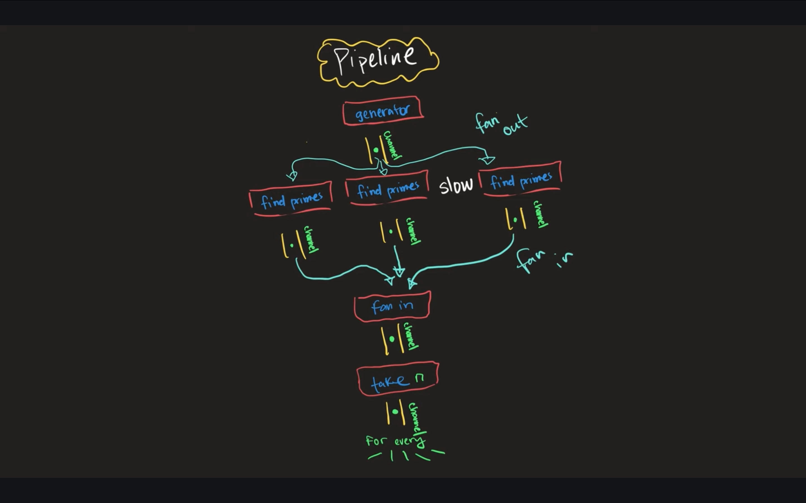

# concurrency-patterns
Three main concurrency patterns in go are:

## For-select loop 
* Buffered channel is made if we give a capacity in the make
* For asynchronous communication we need to have a buffered channel
* An unbuffered channel provides a guarante that an exchange between 2 go-routines is performed at the instant the send and receive take place : a receiving goroutine have to wait for the sending goroutine (syncronous communication)
* With buffered channel we use a queue like functionality where we can send data to channel and forget upto the alloted capacity 

## Done channels 
* Mechanism for main go routine to cancel the infinitely running go routine

## Pipelines
* Communication is syncronous in a pipeline 

## Generators
* A way for us to generate a stream of data on a channel 
* Use generics in generator functions so it can be used for functions which return any type

## Syncronous Channels
* Communication over an unbuffered channel causes Sending and Receiving goroutine to syncronize 
* Even if we have an infnite loop, it will only generate value based on how receiving goroutine is processing

## Fan-in Fan-out
* Sync makes 2 unbuffered channels blocking as one channel have to wait for the other channel to receive the stream. 
* This can be a time-taking process thus we use fan-in and fan-out which means we run the channels in a go-routine concurrently.

